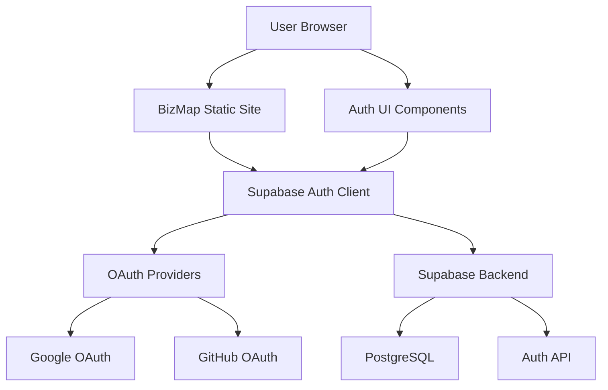
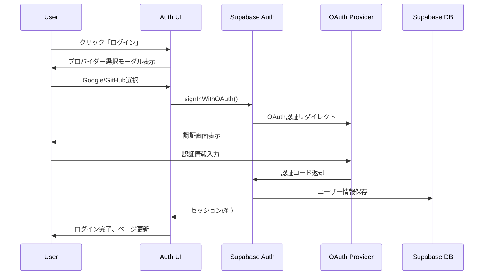

# Design Document: OAuth認証追加

## 0. ユーザー価値と実装目的

### なぜ今OAuth認証を実装するのか

#### 即座に提供する価値（Phase 1 - 今回実装）

1. **パーソナライズされた記事推薦**
   - ログインユーザーの閲覧履歴を自動記録
   - 興味のあるカテゴリー・著者に基づいた記事推薦
   - 「あなたへのおすすめ」セクションをトップページに表示

2. **ブックマーク機能（ワンクリック保存）**
   - 気になる記事をブックマーク
   - マイページで一覧表示
   - 読了管理（「後で読む」リスト）

3. **記事閲覧進捗の保存**
   - 長文記事の途中離脱時、続きから読める
   - 複数デバイスで読書状態を同期

4. **著者フォロー機能**
   - お気に入りの経営者・ライターをフォロー
   - 新着記事を「フォロー中の著者」セクションで確認
   - 将来的にメール通知対応予定

#### 実装するUI（Phase 1で公開）

```
✅ ログイン/ログアウト
✅ ユーザーアバター表示
✅ ブックマークボタン（記事詳細ページ）
✅ 著者フォローボタン（著者ページ）
✅ マイページ
   ├─ ブックマーク一覧
   ├─ フォロー中の著者
   └─ 閲覧履歴
```

### Phase 1で提供する体験フロー

#### ケース1: 初回訪問ユーザー

```
1. BizMapで経営者インタビュー記事を閲覧
2. 気になる記事でブックマークボタンをクリック
3. 「ログインしてブックマーク」モーダル表示
4. Googleアカウントでワンクリックログイン
5. ブックマーク完了、マイページへアクセス可能に
```

#### ケース2: 再訪問ユーザー

```
1. BizMapにアクセス（自動ログイン状態）
2. トップページに「あなたへのおすすめ」表示
   - 過去閲覧したカテゴリーに関連する記事
   - フォロー中の著者の新着記事
3. 記事を途中まで読んで離脱
4. 後日再訪問時、前回の続きから読める
```

### Phase 2以降の拡張（バックエンドのみ準備）

以下の機能はデータベース構造・API関数は今回実装しますが、UI非表示とします：

```
🔧 コメント機能（準備済み、UI非表示）
🔧 いいね機能（準備済み、UI非表示）
🔧 記事シェアトラッキング（準備済み、UI非表示）
```

### ユーザー登録を促す価値提案

#### サイト上での訴求メッセージ

```
「BizMapに登録すると」
✅ 気になる記事をブックマーク保存
✅ お気に入りの経営者をフォロー
✅ あなたに合った記事をおすすめ
✅ 読みかけの記事を続きから閲覧

無料・30秒で登録完了
```

### 実装優先度の根拠

BizMapは経営者インタビューメディアであり、ユーザーは：

- **複数の経営者記事を比較検討したい** → ブックマーク必須
- **特定の経営者を継続的にフォローしたい** → 著者フォロー必須
- **自分のキャリアステージに合った記事を読みたい** → パーソナライズ推薦必須

これらは**今すぐ提供すべきコア価値**であり、OAuth認証はその基盤となります。

## 1. 技術選定

### 最終決定: Supabase Auth（外部認証サービス）

#### 選定理由

1. **静的サイト構成の完全維持**: SSR不要、Astroの設定変更なし
2. **透明性のある料金**: 100,000 MAUまで無料、その後$0.00325/MAU
3. **開発者体験**: 優れたSDK、TypeScript完全対応、豊富なドキュメント
4. **セキュリティ**: オープンソース、PostgreSQL RLS統合、業界標準準拠
5. **統合性**: 将来的なデータベース機能拡張時にシームレス統合可能

### 他選択肢との比較

| 項目               | Supabase Auth | Auth0      | Firebase Auth | auth-astro (SSR) |
| ------------------ | ------------- | ---------- | ------------- | ---------------- |
| **料金**           | $0/100K MAU   | $35-240/月 | $0/50K MAU    | 実装コスト       |
| **静的サイト維持** | ✅            | ✅         | ✅            | ❌ (SSR必須)     |
| **開発体験**       | ⭐⭐⭐⭐⭐    | ⭐⭐⭐⭐   | ⭐⭐⭐⭐      | ⭐⭐⭐           |
| **TypeScript**     | ✅ 完全対応   | ✅         | ✅            | ✅               |
| **保守性**         | ⭐⭐⭐⭐⭐    | ⭐⭐⭐⭐   | ⭐⭐⭐⭐      | ⭐⭐             |
| **拡張性**         | ⭐⭐⭐⭐⭐    | ⭐⭐⭐⭐⭐ | ⭐⭐⭐⭐      | ⭐⭐⭐           |

**決定理由**: コスト効率性、静的サイト維持、将来の拡張性を総合的に評価

## 2. アーキテクチャ設計

### 2.1 全体アーキテクチャ



### 2.2 認証フロー設計



### 2.3 データフロー設計

#### ログイン状態管理

```typescript
// クライアントサイドの認証状態
interface AuthState {
  user: User | null;
  session: Session | null;
  loading: boolean;
  error: string | null;
}
```

#### セッション永続化

- **localStorage**: Supabaseアクセストークン
- **Cookie**: HTTPOnly Refresh Token（Supabase管理）
- **メモリ**: 一時的なユーザー情報キャッシュ

## 3. コンポーネント設計

### 3.1 新規コンポーネント一覧

```
src/components/auth/
├── AuthButton.astro           # ログイン/ログアウトボタン
├── AuthModal.astro            # OAuth プロバイダー選択モーダル
├── UserAvatar.astro           # ログイン後のユーザーアバター
├── UserDropdown.astro         # ユーザーメニュードロップダウン
└── AuthProvider.tsx           # React Context Provider (認証状態管理)
```

### 3.2 既存コンポーネントの変更

#### `src/components/elements/top-header.astro`

```astro
---
// 既存のインポート
import SearchModal from "./search-modal.astro";
import AuthButton from "../auth/AuthButton.astro"; // 🆕 追加
---

<div class="navbar-end">
  <ThemeController />
  <button class="btn btn-ghost btn-circle" onclick="search_modal.showModal()">
    <Search01 />
  </button>
  <AuthButton /> <!-- 🆕 認証ボタン追加 -->
</div>
```

### 3.3 コンポーネント仕様

#### `AuthButton.astro`

```astro
---
// ログイン状態に応じてボタン/アバターを切り替え
// client:load directive でReactコンポーネント化
---

<div id="auth-button" class="ml-2">
  <!-- Reactコンポーネントがマウント -->
</div>

<script>
  // Supabase認証状態の監視
  // ログイン状態に応じたUI切り替え
</script>
```

#### `AuthModal.astro`

```astro
---
// DaisyUI Modal + OAuth プロバイダーボタン
---

<dialog id="auth_modal" class="modal">
  <div class="modal-box">
    <h3 class="font-bold text-lg">ログイン</h3>
    <div class="py-4 space-y-3">
      <button class="btn btn-outline w-full" id="google-auth">
        <GoogleIcon /> Googleでログイン
      </button>
      <button class="btn btn-outline w-full" id="github-auth">
        <GitHubIcon /> GitHubでログイン
      </button>
    </div>
  </div>
  <form method="dialog" class="modal-backdrop">
    <button>close</button>
  </form>
</dialog>
```

#### `UserAvatar.astro`

```astro
---
// ユーザーアバター + ドロップダウンメニュー
// プロフィール画像、表示名、ログアウトボタン
---

<div class="dropdown dropdown-end">
  <div tabindex="0" role="button" class="btn btn-ghost btn-circle avatar">
    <div class="w-8 rounded-full">
      
    </div>
  </div>
  <ul class="dropdown-content menu bg-base-100 rounded-box z-[1] w-52 p-2 shadow">
    <li><span class="text-sm">{user.displayName}</span></li>
    <li><hr class="my-1"></li>
    <li><button id="logout-btn">ログアウト</button></li>
  </ul>
</div>
```

## 4. ファイル構成

### 4.1 新規ディレクトリ・ファイル

```
src/
├── lib/
│   └── auth/                  # 🆕 認証関連ロジック
│       ├── supabase.ts        # Supabaseクライアント設定
│       ├── types.ts           # 認証関連型定義
│       ├── utils.ts           # 認証ユーティリティ関数
│       └── constants.ts       # 認証関連定数
│
├── components/
│   └── auth/                  # 🆕 認証コンポーネント
│       ├── AuthButton.astro
│       ├── AuthModal.astro
│       ├── UserAvatar.astro
│       └── UserDropdown.astro
│
└── assets/
    └── svgs/                  # 🆕 OAuth プロバイダーアイコン
        ├── google.astro
        └── github.astro
```

### 4.2 設定ファイル変更

#### `package.json` 依存関係追加

```json
{
  "dependencies": {
    "@supabase/supabase-js": "^2.39.0"
  }
}
```

#### `src/env.d.ts` 環境変数型定義

```typescript
interface ImportMetaEnv {
  readonly PUBLIC_SUPABASE_URL: string;
  readonly PUBLIC_SUPABASE_ANON_KEY: string;
}
```

## 5. 状態管理設計

### 5.1 認証状態の管理

```typescript
// src/lib/auth/types.ts
export interface AuthState {
  user: User | null;
  session: Session | null;
  loading: boolean;
  initialized: boolean;
}

// src/lib/auth/store.ts
import { create } from "zustand";

export const useAuthStore = create<AuthState>((set) => ({
  user: null,
  session: null,
  loading: true,
  initialized: false,

  setAuth: (user: User | null, session: Session | null) =>
    set({ user, session, loading: false, initialized: true }),

  setLoading: (loading: boolean) => set({ loading }),
}));
```

### 5.2 セッション復元フロー

```typescript
// src/lib/auth/supabase.ts
export const initializeAuth = async () => {
  const {
    data: { session },
  } = await supabase.auth.getSession();

  if (session) {
    useAuthStore.getState().setAuth(session.user, session);
  } else {
    useAuthStore.getState().setAuth(null, null);
  }

  // セッション変更を監視
  supabase.auth.onAuthStateChange((event, session) => {
    useAuthStore.getState().setAuth(session?.user || null, session);
  });
};
```

## 6. セキュリティ設計

### 6.1 Supabaseプロジェクト設定

#### 認証設定

```sql
-- Row Level Security (RLS) 設定例
ALTER TABLE profiles ENABLE ROW LEVEL SECURITY;

CREATE POLICY "Users can view own profile"
ON profiles FOR SELECT
USING (auth.uid() = id);

CREATE POLICY "Users can update own profile"
ON profiles FOR UPDATE
USING (auth.uid() = id);
```

#### OAuth プロバイダー設定

```bash
# Supabase Dashboard での設定項目
# Google OAuth:
# - Client ID: GOOGLE_OAUTH_CLIENT_ID
# - Client Secret: GOOGLE_OAUTH_CLIENT_SECRET
# - Redirect URL: https://[project-ref].supabase.co/auth/v1/callback

# GitHub OAuth:
# - Client ID: GITHUB_OAUTH_CLIENT_ID
# - Client Secret: GITHUB_OAUTH_CLIENT_SECRET
# - Redirect URL: https://[project-ref].supabase.co/auth/v1/callback
```

### 6.2 フロントエンド セキュリティ

#### Content Security Policy (CSP)

```html
<!-- src/layouts/base.astro -->
<meta
  http-equiv="Content-Security-Policy"
  content="default-src 'self'; 
               connect-src 'self' https://*.supabase.co; 
               img-src 'self' data: https:;"
/>
```

#### 環境変数管理

```bash
# .env.local (開発環境)
PUBLIC_SUPABASE_URL=https://your-project.supabase.co
PUBLIC_SUPABASE_ANON_KEY=your-anon-key

# Vercel Environment Variables (本番環境)
# 同じ変数をVercel管理画面で設定
```

## 7. パフォーマンス最適化

### 7.1 バンドル最適化

#### 動的インポート

```typescript
// 認証機能を必要時のみロード
const loadAuth = async () => {
  const { supabase } = await import("@/lib/auth/supabase");
  return supabase;
};
```

#### Code Splitting

```astro
<!-- 認証モーダルを遅延ロード -->
<AuthModal client:idle />
<UserAvatar client:load />
```

### 7.2 UX最適化

#### 楽観的UI更新

```typescript
// ログアウト時の即座なUI更新
const handleLogout = async () => {
  // 1. UI を即座に更新
  useAuthStore.getState().setAuth(null, null);

  // 2. バックエンドにログアウト要求
  await supabase.auth.signOut();
};
```

#### Loading States

```astro
<!-- 認証状態確認中の表示 -->
{loading && (
  <div class="skeleton w-8 h-8 rounded-full"></div>
)}

{!loading && user && (
  <UserAvatar user={user} />
)}

{!loading && !user && (
  <AuthButton />
)}
```

## 8. 型定義

### 8.1 Supabase 型定義

```typescript
// src/lib/auth/types.ts
export interface Database {
  public: {
    Tables: {
      profiles: {
        Row: {
          id: string;
          display_name: string;
          avatar_url: string | null;
          email: string | null;
          created_at: string;
          updated_at: string;
        };
        Insert: {
          id: string;
          display_name: string;
          avatar_url?: string | null;
          email?: string | null;
        };
        Update: {
          display_name?: string;
          avatar_url?: string | null;
        };
      };
    };
  };
}

export type User = Database["public"]["Tables"]["profiles"]["Row"];
```

### 8.2 認証関連型定義

```typescript
// src/lib/auth/types.ts
export interface AuthConfig {
  supabaseUrl: string;
  supabaseAnonKey: string;
  redirectTo?: string;
}

export interface OAuthProvider {
  name: "google" | "github";
  displayName: string;
  icon: string;
  buttonClass: string;
}

export interface AuthError {
  message: string;
  status?: number;
  code?: string;
}
```

## 9. テスト戦略

### 9.1 ユニットテスト

```typescript
// src/lib/auth/__tests__/utils.test.ts
import { describe, it, expect } from "vitest";
import { formatUserDisplayName } from "../utils";

describe("Auth Utils", () => {
  it("should format user display name correctly", () => {
    const user = {
      display_name: "John Doe",
      email: "john@example.com",
    };

    expect(formatUserDisplayName(user)).toBe("John Doe");
  });
});
```

### 9.2 統合テスト

```typescript
// src/lib/auth/__tests__/supabase.test.ts
import { describe, it, expect, beforeEach } from "vitest";
import { createMockSupabaseClient } from "./mocks";
import { initializeAuth } from "../supabase";

describe("Supabase Auth Integration", () => {
  beforeEach(() => {
    // モッククライアントのセットアップ
  });

  it("should initialize auth state correctly", async () => {
    // テスト実装
  });
});
```

## 10. デプロイメント設定

### 10.1 Vercel環境変数

```bash
# Vercel CLI または Web UIで設定
vercel env add PUBLIC_SUPABASE_URL
vercel env add PUBLIC_SUPABASE_ANON_KEY
```

### 10.2 Supabase設定

#### Site URL設定

```bash
# Supabase Dashboard > Authentication > URL Configuration
Site URL: https://biz-map.bond-llc.jp
Additional redirect URLs:
  - http://localhost:4321
  - https://media-site-preview.vercel.app
```

#### OAuth プロバイダー登録

```bash
# Google Cloud Console
# OAuth 2.0 クライアント ID 作成
# 承認済みのリダイレクト URI:
# https://[supabase-project-ref].supabase.co/auth/v1/callback

# GitHub Developer Settings
# OAuth App 作成
# Authorization callback URL:
# https://[supabase-project-ref].supabase.co/auth/v1/callback
```

## 11. 運用・監視

### 11.1 エラーハンドリング

```typescript
// src/lib/auth/error-handler.ts
export const handleAuthError = (error: AuthError) => {
  console.error("Auth Error:", error);

  // ユーザーフレンドリーなエラーメッセージ
  const userMessage = getErrorMessage(error.code);

  // エラー通知（Toast等）
  showErrorToast(userMessage);

  // 必要に応じてSentry等にエラー送信
  // captureException(error);
};
```

### 11.2 分析・監視

```typescript
// 認証イベントの追跡
const trackAuthEvent = (event: string, provider?: string) => {
  // Google Analytics イベント送信
  gtag("event", event, {
    event_category: "auth",
    auth_provider: provider,
  });
};
```

## 12. Phase 1の詳細実装スコープ

### 今回実装する機能（すべてUI公開）

| 機能                   | 説明                  | 実装場所                   |
| ---------------------- | --------------------- | -------------------------- |
| **OAuth認証**          | Google/GitHubログイン | ヘッダー                   |
| **ブックマーク**       | 記事の保存・削除      | 記事詳細ページ、マイページ |
| **著者フォロー**       | 著者のフォロー・解除  | 著者ページ、マイページ     |
| **閲覧履歴**           | 自動記録・一覧表示    | マイページ                 |
| **パーソナライズ推薦** | 履歴ベースの推薦記事  | トップページ               |
| **マイページ**         | 個人ダッシュボード    | `/my`                      |

### Phase 2以降（バックエンドのみ準備、UI非表示）

以下はテーブル・API関数のみ実装し、フィーチャーフラグで制御：

```typescript
// src/lib/config/features.ts
export const FEATURES = {
  // Phase 1 (今回公開)
  AUTH: true,
  BOOKMARKS: true,
  AUTHOR_FOLLOW: true,
  READING_HISTORY: true,
  PERSONALIZED_FEED: true,

  // Phase 2 (準備のみ、UI非表示)
  COMMENTS: false, // 記事コメント
  LIKES: false, // いいね機能
  SHARE_TRACKING: false, // シェアトラッキング
  NOTIFICATIONS: false, // 通知システム
} as const;
```

### データベーステーブル（すべて今回実装）

```sql
-- ✅ Phase 1で使用
CREATE TABLE profiles (...);
CREATE TABLE bookmarks (...);
CREATE TABLE author_follows (...);
CREATE TABLE reading_history (...);

-- 🔧 Phase 2用（準備のみ）
CREATE TABLE comments (...);
CREATE TABLE article_likes (...);
CREATE TABLE share_events (...);
```

---

この設計書は要件定義に基づいて作成されました。実装前に内容を確認し、承認をお願いします。
